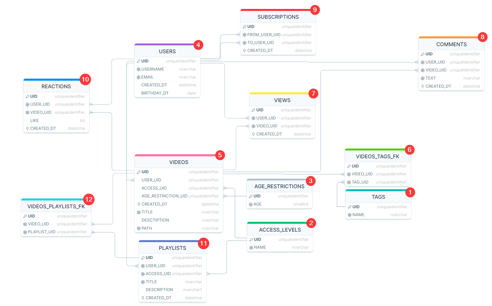

# VideoHosting database
  
Coursework for university - I implemented a database similar to YouTube.

# Tables scheme
[](Assets/Scheme_v2.png)

# QUICK START
1) If you use windows
```bash
git config --global core.autocrlf false
```
2) Git clone this project
```bash
git clone https://github.com/BaggerFast/VideoHostingDatabase.git
```
3) Set hard password to user **SA** into [docker-compose.yml](docker-compose.yml)
```bash
MSSQL_SA_PASSWORD=""
```
4) Connect to database via [docker-compose](docker-compose.yml)
```bash
docker-compose -up
```
5) Scripts structure
   - STRUCTURE.sql - Create table
   - INSERT.sql - Insert data into table
   - SELECT.sql - Select table
   - TRUNCATE.sql - Clear table
   - DROP.sql - Delete table
6) Use scripts in this order
   - [TAGS](VideoHosting/TAGS)
   - [ACCESS_LEVELS](VideoHosting/ACCESS_LEVELS)
   - [AGE_RESTRICTIONS](VideoHosting/AGE_RESTRICTIONS) 
   - [USERS](VideoHosting/USERS)
   - [VIDEOS](VideoHosting/VIDEOS) 
   - [FK_VIDEO_TAGS](VideoHosting/_FK_VIDEO_TAGS)
   - [VIEW](VideoHosting/VIEWS)
   - [COMMENTS](VideoHosting/COMMENTS)
   - [SUBSCRIPTIONS](VideoHosting/SUBSCRIPTIONS)
   - [REACTIONS](VideoHosting/REACTIONS)
   - [PLAYLISTS](VideoHosting/PLAYLISTS)
   - [FK_VIDEO_PLAYLISTS](VideoHosting/_FK_VIDEO_PLAYLISTS)
